# Beyond Request/Response: Understanding HTTP, WebSockets, and SSE.

In the world that we live in today, everyone wants everything instantly. When we write a message in a chat app we want it to be instantly delivered and to be seen by the other person immediately or when we are analyzing crypto graphs, we expect the price to tick up and down without having to refresh. Everyone is in a rush and we know just how much people love real-time updating facilities.

But the point is that **the internet was not originally built for that**. 

The web was not made for conversations so how did we manage to go from static pages to instant live streams, live updates, etc? To understand this let me first introduce you to the three ways a browser talks to a server: **HTTP**, **WebSockets** and **SSE(Server-Sent Events)**, using some analogies that you are already familiar with because that’s the best way to remember things!

---

## HTTP: (“The letter system”)

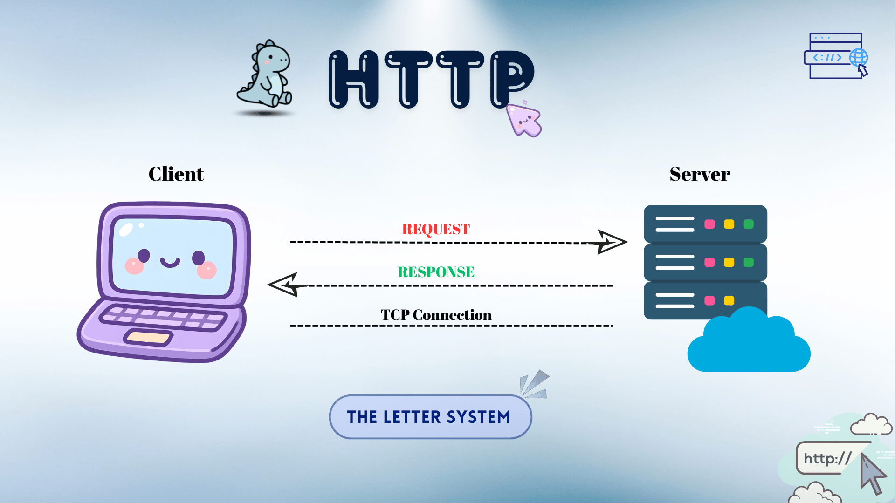

HTTP stands for **Hypertext Transfer Protocol**. It powers almost every other website on the internet. It is a stateless application-layer protocol (set of rules) used for transferring hypertext (web pages) over the internet.

> HTTP works on the request/response basis. To understand better, let's think of it like **sending a letter**.

1. **Request** - You (client) write a letter asking for some information and mail it to the server.
2. **Response** - Server gets your letter, finds the needed information and then mails you a letter back.
3. **Close** - That’s all, then the connection closes. The server completely forgets about you as it didn’t maintain any kind of database to store data about you (this is why http is called **‘stateless’**).

If you want to ask another question you have to start all over again. Remember that’s exactly how letters work, you don’t simply write the content and leave it, you mention the address, signature etc everytime you write a letter. 

**Uni-directional / Request-Response**: The client (browser) always initiates the conversation. The **server can’t speak to the client unless the client speaks first**. You make a request, the server responds.
In the case of HTTP, the server treats every single request as a brand transaction (conversation) from a complete stranger, even if it is from the same person who made a request a second ago.

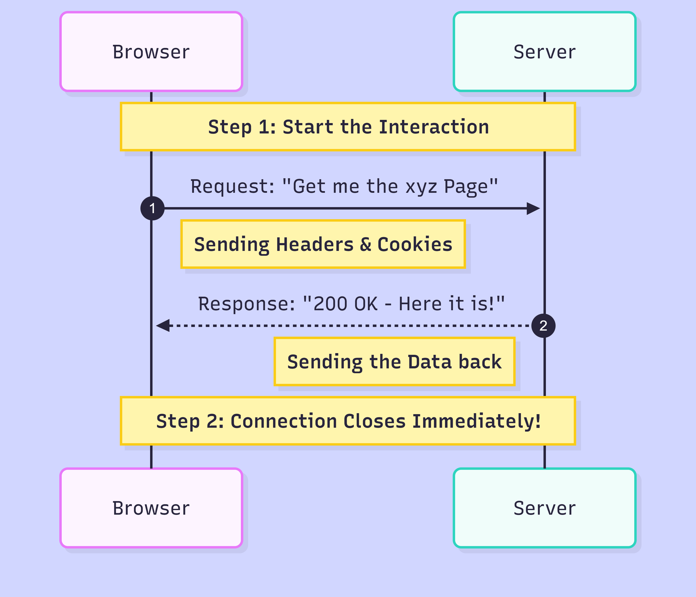

> Now why on earth would we design it like that?

### Advantages of HTTP for being stateless
- **Scalability (The biggest reason)**: Assume Facebook has 1 billion users- 
  ***If HTTP were state-FULL***: The server would have to keep a file open in the RAM for every single user to keep a record of the individuals’ actions. Can you imagine the load? That’s a lot, a billion open files can crash even the biggest supercomputer in the world! 
  ***But since HTTP are state-LESS***: The server answers to your request and instantly clears up the RAM. It doesn’t carry the ‘baggage’ of remembering you and your actions.

- **Simplicity**: In case of any problem with the connection mid-transaction the server doesn’t need to panic about things like ‘restoring the session’, the client (you) can send the request again. Just that simple!

- **Load Balance**: Imagine you have two servers - Request1 > Server A ; Request2 > Server B.      
We know how forgetful HTTP is? Every transaction is brand new, thus Server2 doesn’t have to ask Server1 about anything like “Hey who’s this guy?”. The servers can perform independently with requests, hence Server B can process the request on its own. 

### Limitations of HTTP
Being stateless is a huge relief for the server, but from the user’s perception it’s more work and sometimes frustrating. 

- You have to continuously remind the server who you are.
- This adds extra data (weight) to every request, which slows down the internet connection, especially on mobile phones.
- Login every time you visit a website, even when you want to be kept logged in.
- It is impossible to create multi-step processes (like buying items or filling out a 3-page form) without using complex workarounds to store that data somewhere else.
> Then how do websites remember you?

### HTTP’s Hack to ‘remember’ 
Here we introduce the forgotten GOAT - **Tokens** or **Cookies**.
Have you noticed how when you log in to some websites (like Whatsapp web) and leave without logging out and revisit after a while you are still logged in? → How?
Or how when you visit websites they offer you “cookies”? → What are those for?

It’s completely true that **HTTP is stateless**. What we do is **fake state**, using Tokens or Cookies. 
It’s like a sticky note that contains data for the forgetful HTTP to recognize us. 
We make the browser send a “reminder note” (Tokens or  Cookies) along with all of our requests to the server, so that it knows who we are. 
Every time you send a request, you aren't just sending data. You are sending **Headers** (metadata, cookies, authentication tokens, user-agent info).
HTTP still forgets about you after a transaction is complete but it recognizes you after getting the “reminder note” (Tokens or  Cookies) that your browser sends with your new request. 

That’s how we deal with our forgotful HTTP. You see, the amount of thoughts put behind a solution is truly appreciable.

---

## The Polling Problem: (Why we needed an upgrade) 
HTTP is amazing for static pages and all but as mentioned before it is like ‘the letter system’ thus **slow** (start / stop / start / stop). Can you imagine using this slow ‘letter system’ to build a Live Chat app?

To know if you received any new message from your friend you have to ask the server - “Hey is there any new message?”
The server checks and then replies - ”No”.
Then again after a few seconds you ask  - “Are there any new messages now?”
Server - “No…”
A few seconds later you ask again - “Now?”
Server checks and replies - “Yes, here is the message”. You have to check up on the server for any new messages, it can’t simply give you the message when received because it follows request/response, you have to request then only the server can respond. This is called **‘Polling’** more specifically **‘Short-Polling’**. It’s like checking your physical mail box every few seconds in hopes of getting a new letter. It’s as exhausting as it sounds, it actually exhausts the server (CPU load) and also **wastes a lot of data** since you send heavy headers back and forth for no reason. 

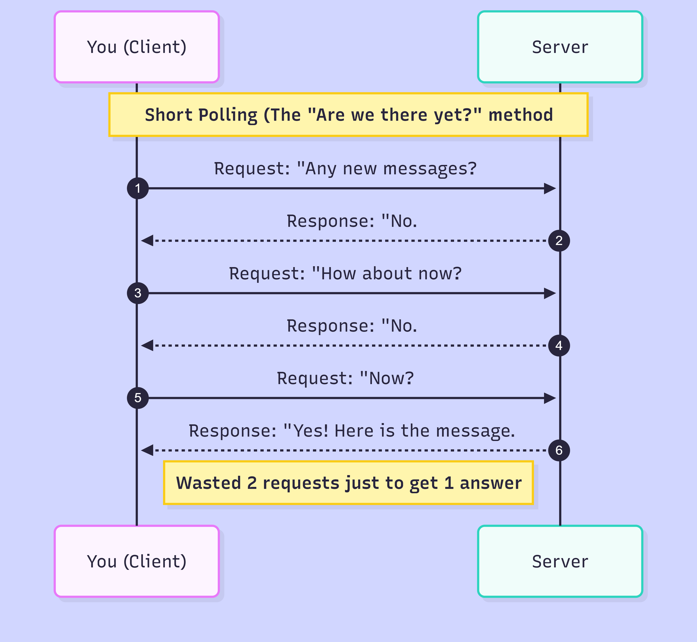

This situation can be helped by not having to send those heavy headers every two seconds, instead request once and the server checks, waits and when it receives the message it sends it to you so that you don’t have to nag the server every two seconds. This is called **‘Long-Polling’**. It’s something like this:
You - “Is there any new message?”
Server -  waits while keeping the connection open for 30 seconds..
Server - “Now I have one, here is your message.” → Connection closes

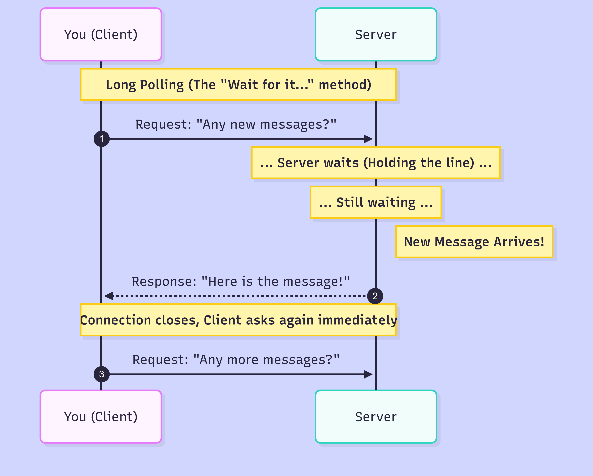

It is better than short polling, but **re-establishing connections constantly is still heavy**.
If a problem is acknowledged, you know someone did come up with a solution to that !

For this reason **websockets** were invented.

---

## WebSockets: (The "Phone Call”)

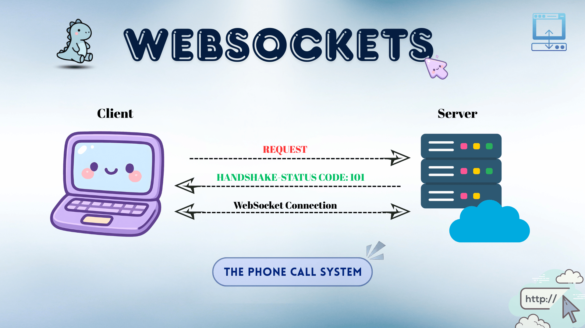

Websockets are compared to phone calls for understanding because just like a phone call it allows two way connection between you (client) and the server. You don’t have to ask the server for it to respond, if it receives a message it can give it to you without you having to request it every time there is a message.
So basically websockets are:
- **Bi-directonal**: Server can give you the new messages without you having to ask for it.
- **Low overhead**: Remember how we send heavy headers to HTTP every time because after every transaction, the connection is closed and needs to be re-connected? In the case of websockets we sent that only once and after that we just sent light-weight data frames. 
- **Persistent**: It’s a phone call, it stays connected until your business with the server is done. The line stays alive until one of us (i.e. client or server) decides to leave.
- **State-FULL**: While on call, in mid conversation we do not forget whom we were conversing with right? Just like that, in the case of websockets, the server doesn’t need to recheck or reprocess continuously to remember you, it just does.

### Upgrade to WebSocket

You might think, “If the web runs on HTTP, how does it change to websockets ? Where and how does this change happen?”
The most interesting fact is that websockets don’t just appear magically, HTTP is upgraded to websockets. Both are protocols, so basically it’s a **protocol switch**, from HTTP → WebSockets. Taking a look back we know that the **client sends headers to the server**, right here we specify that we want to upgrade to “WebSockets”, then the server does its processing and if everything’s alright, it passes a **101 Status** and the protocol switch happens immediately. This thing going on for the upgrade to happen is termed as **“handshake”**.
It's like sending a letter that says: 'Stop writing back. Call me on this number immediately.' And if the server agrees you get a call!

### Advantages of WebSockets
- **Real-time Speed**: Since the connection is established for a complete session and not just one set of request/response, the data transfers instantly, unlike HTTP, there is no ’handshake’ delay for every single message.
- **Low overhead**: We send the heavy headers to the server only once and after that we just send lightweight data frames.
- **Bi-directonal**: Unlike the case of HTTP, in Websockets the server can give you the messages without you having to ask for it i.e. the server doesn’t necessarily need you to initiate the conversation for it to talk (transfer data) to you.
- **Persistent**: The connection between the client and server stays alive throughout a complete session and not just one set of request/response.
- **State-FULL**: The server remembers you for the entire duration of the ‘phone call’. 

### Limitations of WebSockets
But if websockets are that good why don’t we use them everywhere? Let’s try to see some of the reasons one by one.
- **Server load**: Imagine there are 1,00,000 users, the server has to hold 1,00,000 phone lines open simultaneously. And that’s a lot and consumes a massive amount of RAM and CPU, because unlike HTTP it can’t simply clear up the RAM after a transaction is completed.
- **Scaling is difficult**: Remember how HTTP was easy to scale? If Server A is busy, Server B can handle the request. In the case of WebSockets it’s not that easy actually. If a user is connected to Server A, they are physically attached to it and in case of any problem you can’t just move the ongoing phone call to Server B without cutting and reconnecting. No you can’t have a conference call!
- **Fragility**: Consider a case where the Wi-Fi cuts out for a second. HTTP → next request just waits for the internet connection to be back. Websockets → disconnects immediately, like how a phone call end when there is no network, the developer has to write complex code to detect the drop and automatically reconnect. 
- **Firewall Issue**: Firewalls don’t like keeping connections open for a long time and might end the connection between the client and the server thinking of it being a virus or some glitch, also if there is no exchange between the client and server thinking it’s a ‘Zombie connection’. → Silence means you are dead!

### How to see a WebSocket request/response in the Network tab?
This is the most interesting part actually. You can see the convo going on in WebSockets in the Network tab of the dev tools. 

***Check it out yourself! Here’s how.***

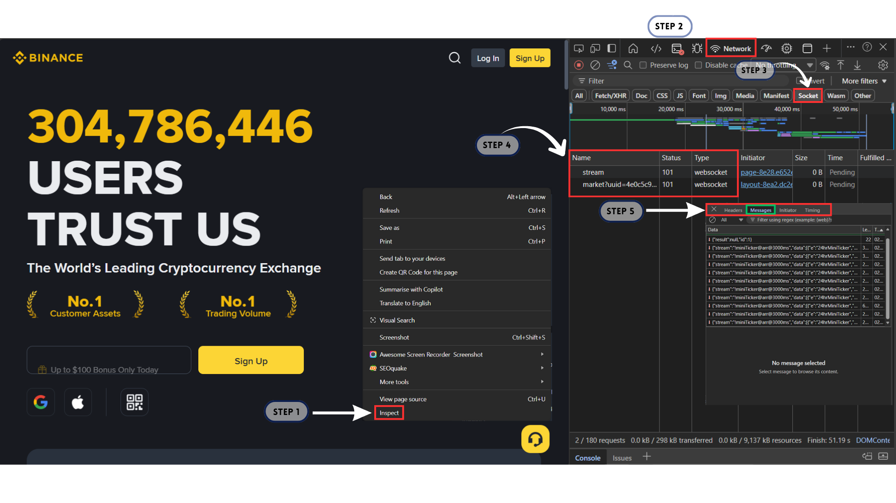

> Step 1: Open DevTools

  → Open Chrome (or any browser that allows you to inspect web pages). 
  → Go to a website that uses WebSockets. (Which one though? → a sample binance.com) 
  → Right click on the webpage and choose ‘inspect’ (or just press F12) 
  → On top find the ‘Network tab’ and click it. 

> Step 2: Filter

→ Filter out the specific thing we are looking for by finding the filter that says something like ‘sockets’ or ‘WS’.

> Step 3: Find the ‘Handshake’

→ Refresh the page. Now a few things appear in the list.
→ Name: this section will have some things like ‘stream’, ‘connect’, etc. Status: This shows status like 101 - successful protocol switch; 200 - here is your file.

> Step 4: Seeing the traffic

→ Click a websocket request from the list (anyone with a status - 101).
→ You get 4 tabs for the new section opened: ‘Headers’, ‘Messages’, ‘Initiator’ and ‘Timing’. 
→ Check them all out to get to know how all these look and what they contain for better understanding.

> Step 5: How to read the Message tab

  **The Colours**
  → You will see a table with ‘Data’, ‘Length’ and ‘Time’.
  → In the ‘Data’ column if Green Upwards Arrow - You sent the data to the server. 
  If Red Downwards Arrow - Server sent data to you.

**The Heartbeat**
  → The "Phone Line" will be cut by the internet providers if it is silent for too long.
  - Ping: The Server asks, "Are you still there?"
  - Pong: The Browser replies, "Yes, don't hang up."
  This is automatic.

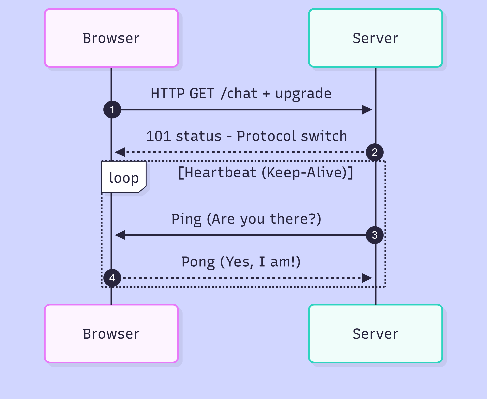

---

## SSE (Server Sent Events): (The "Radio Station”)

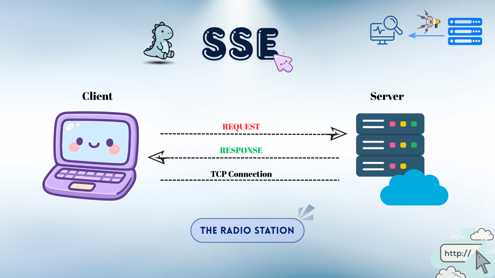

Okay so till here we have a ‘letter system’ (HTTP) that is too slow and a ‘phone call system’ (WebSockets) that is way fast for sure but heavy and complex. 
If you give it some thought you will notice that you don’t always want to talk back, even though you want the server to keep pushing data to you (the client) **without** the server following the principle of **“speak when spoken to”**.

Right here comes the concept of SSE that stands for ***Server Sent Events***.
It’s like the **‘Radio station’**. The radio (server) speaks, you (client) listen and you can’t talk back to it. Those are the RULES!
No special protocols or complex handshakes required though! The connection stays alive as long as you are tuned in.
Fun fact? SSE is just HTTP with a twist, that is not too twisted to understand or implement. 

### How does an SSE work?

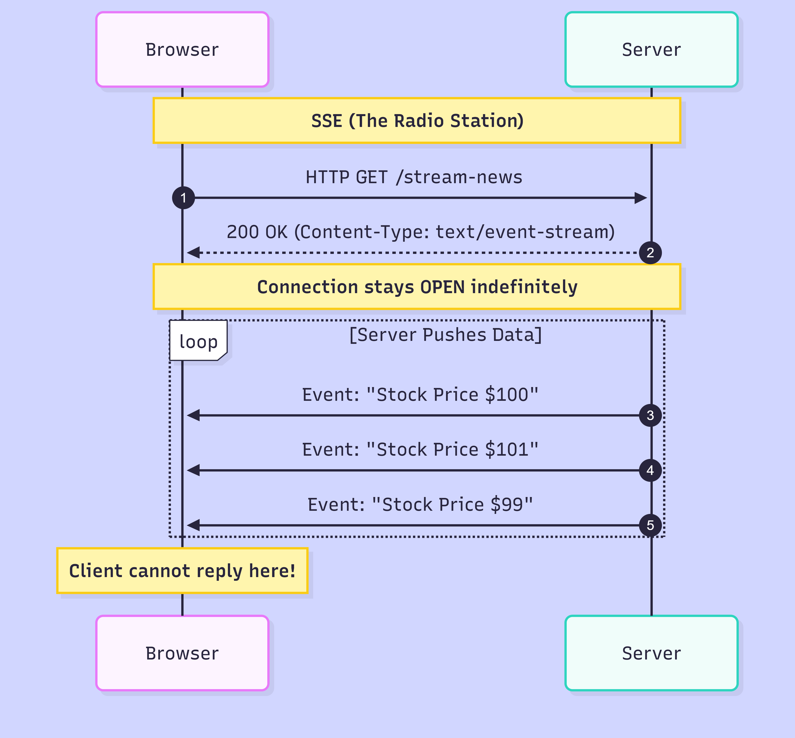

1. **Request**: You sent a normal HTTP GET request (as usual). 
2. **Response**: Server goes, “Here is your file..” BUT for case of SSE, it sets the content-type to text/event-stream. 
3. **Trick behind**: The server never sends the ‘End of file’ signal and it’s like keeping the letter open. It keeps the letter open and writes a new line in the bottom forever → a never ending letter kind of.

### Advantages of SSE
- **Simplicity**: Works over standard HTTP, doesn’t needs special protocols or complex handshakes and that means it works easily with the existing backend (like Nodejs, Python Flask, etc).
- **Automatic Reconnection**: Remember how we need to deal with the reconnection in websockets by writing 	complex code? Here the browser (client) automatically tries to reconnect to the SSE stream without having to write a code solution for it. That’s a life saviour move!
- **Firewall Friendly**: It’s just a special kind of HTTP so Firewall favour it just like HTTP (poor websockets, not firewall friendly)
- **Lightweight**: For a simple one way data flow, it uses less battery and data on devices.

### Limitations of SSE
- **Uni-directional**: You can’t speak, you only listen, and if you do need to then you have to open a separate HTTP request for that.
- **Text only**: SSE is strictly for text. If you want to send a file to the server, you have to first encode it into text (Base64), which is inefficient. Here WebSockets have a plus point, it can handle binary data (like images or audio).
- **Connection Limit**: This is a quirky browser issue. Most browsers (like Chrome) limit you to **6 open connections per domain**.

---

## How to make a choice?

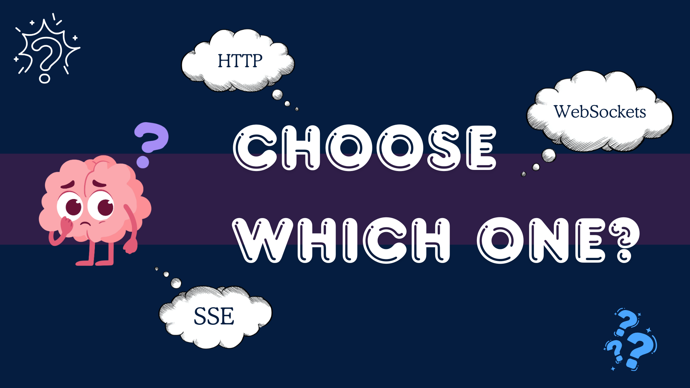

Now on what basis can you choose which one is more suitable amongst HTTP, WebSockets and SSE?
### 1. Use HTTP: (“The letter”)
 - **When** - You need to fetch data, upload a file, just load a webpage. 
 - **Why** - It’s simple, reliable and cacheable.
 - **Example** - Landing pages, login forms, blogs, etc.

### 2. Use WebSockets: (The "Phone Call”)
 - **When** - You need extremely fast, two way connection. Real-time updates needed.
 - **Why** - It’s fast and both sides (client and server) can talk.
 - **Example** - Chat Apps (WhatsApp), Multiplayer Games (Valorant/Chess.com), Collaborative Tools (Figma).

### 3. Use SSE (Server Sent Events): (The "Radio Station”)
 - **When** - Real-time updates are needed and the user mostly just listens (doesn’t need to send data to the server).
 - **Why** - It’s simple, lighter than WebSockets and easier to set up.
 - **Example** - Stock tickers, Live cricket/ football scores.

---

## Bonus Addition - Mermaid.js

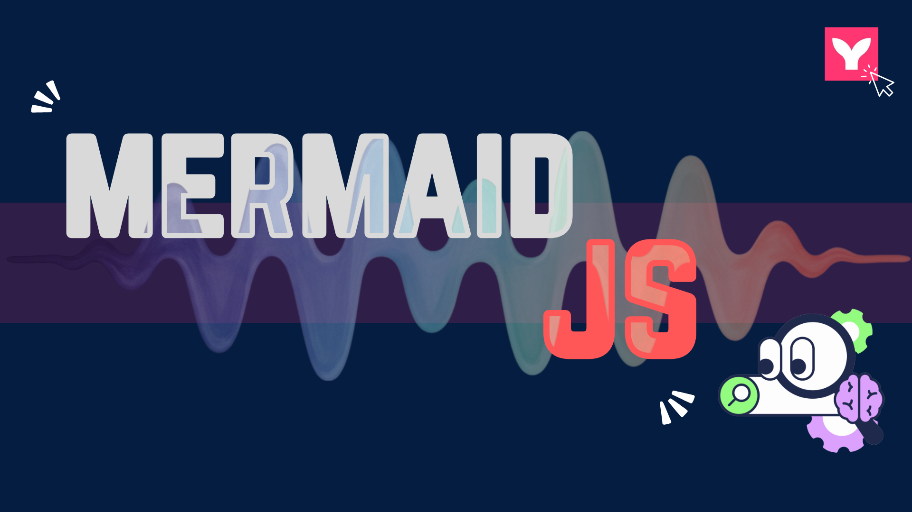

All the things we discussed till now can be turned into visuals. BUT that’s a lot to draw, component by component. 
Throughout this post you would have noticed those oh so well designed explanatory diagrams (sequence diagrams), I did design them but not component by component, can’t catch me working that hard on something which has a far more effective AND easier way to get it done. I designed them using code!

Mermaid is a **JavaScript-based diagramming and charting tool** that renders Markdown-inspired text definitions to create and modify diagrams dynamically.

That’s the book definition. In simple words Mermaid is just a js based tool which you can use to create visuals like flowcharts, gantt charts, sequence diagrams, etc by simply writing blocks of codes. No drag and drops anymore.

Do you see how useful it is especially when you already are a coder? 
You can follow the [Mermaid js doc](http://mermaid.js.org) for more details and updates. 
And it actually gets better when you get to know that no complex installation is required, you can simply try it out on its playground called [Mermaid Live Editor](https://mermaid.live/). On the left side you write the code and on the right the visuals appear, and are updated in real-time thus no need to save changes every time.

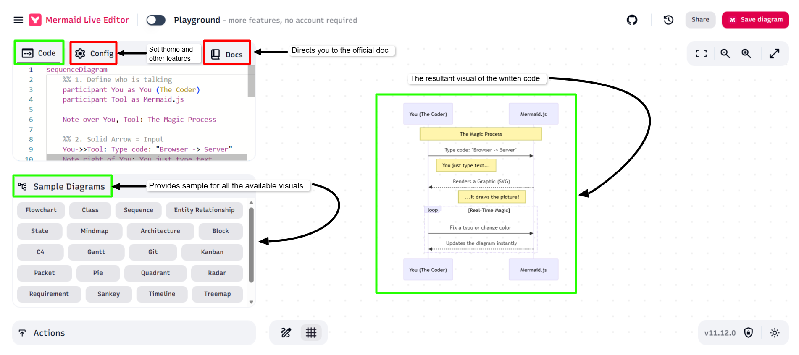

Here is the cool part:

**1. Sample Diagrams**: In the editor, there is a "Sample" button. You can click it to instantly load Flowcharts, Pie Charts, State Diagrams, and more to see how they work.

**2. Themes**: Don't like the default look? You can change the "Theme" in the settings (to Dark Mode, Forest, or Neutral) without changing a single line of code.

Since this is a learner-to-learner conversation let me tell you that you don’t have to be a wizard to be able to use it. Here are the commands I used for all the diagrams in this post, note that they are all **sequence diagrams**, but these commands can be applied to any other visual form just like here.

* ***participant*** : Defines the characters you want in your visuals (like client and server). They appear in the same order they are introduced in the code.
* ***->>*** : It creates a solid line (symbolises Request).
* ***-->>*** : It creates a dotted line (symbolises Response).
* ***Note over*** : It creates the yellow note boxes, like sticky notes for explanation.
* ***loop*** : Creates a dotted box to symbolise repeated actions, with a tag with the text ‘loop’ inside a sim card shape at the left corner (like in SSE working, the heartbeat - ping/pong).
* ***autonumber*** : automatically numbers the transfer arrows to signify the sequence.
* ***%%*** : used to write comments, just like other programming languages, here comments do not have any effect on the function of the code, just there for explanation.
 
And to not leave you hanging, let me summarise mermaid js with a simple sample code that you can check out too!

A sample code that you can try right now! Go to [Mermaid Live Editor](https://mermaid.live/) and paste it in the code section:

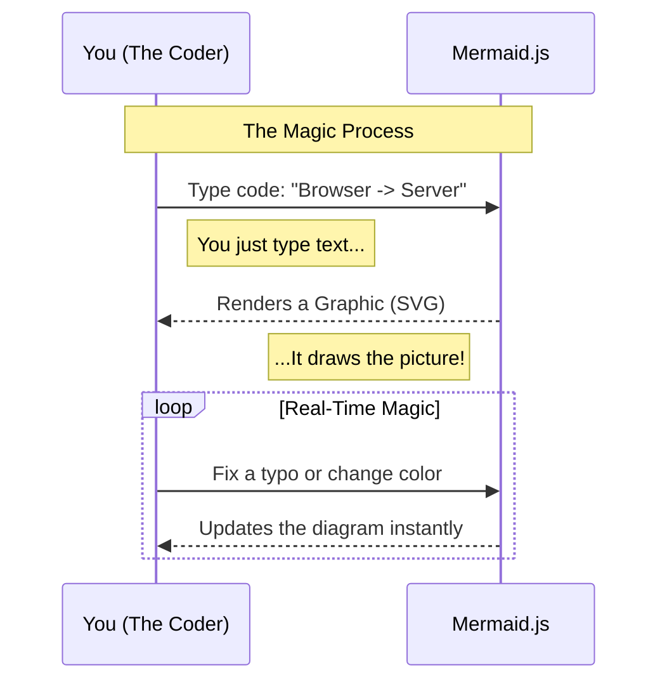

It will result in a sequence diagram that looks like this:

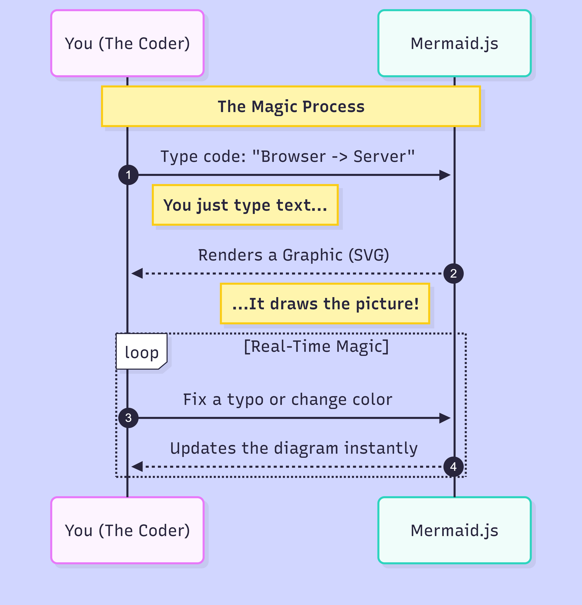

This shows how you use Mermaid.js to create visuals using code/text.

---

## Conclusion
It very important to understand the options you have for better decision making as to which one should be used for which job. 

As developers, our goal is to balance server load with user experience. Whether you are building a simple blog or a high-intensity trading platform, knowing how these protocols work ensures your "instantly delivered" world stays fast and efficient.

Now go ahead, open your DevTools, and see these "letters" and "phone calls" happening in real-time!
And don't forget to try out visual designing using code in Mermaid.js.